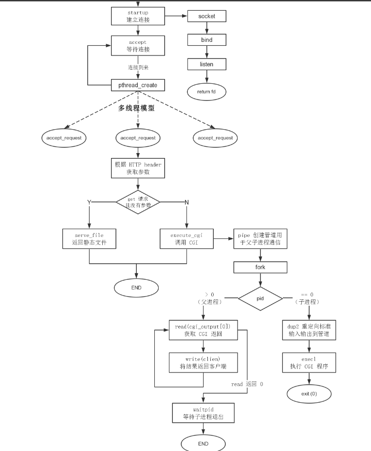
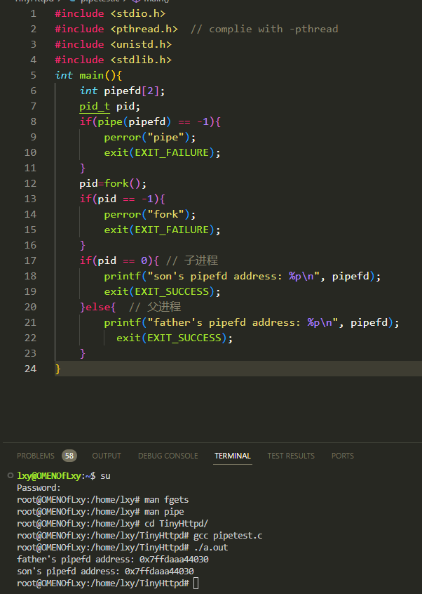
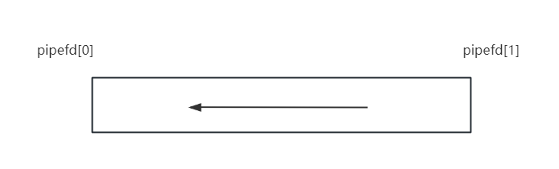
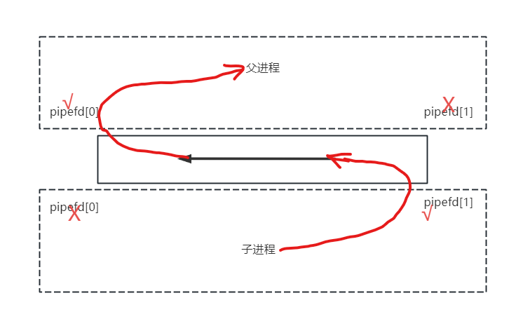
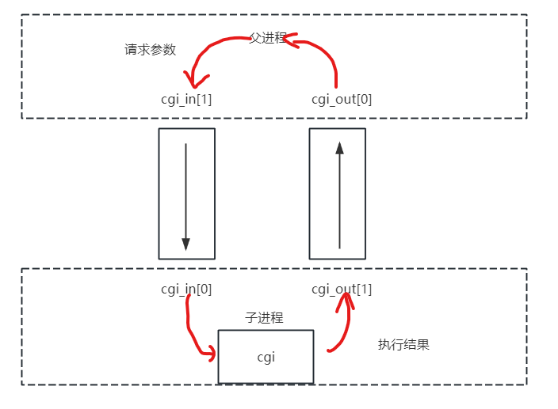

# webServer 项目

## 函数列表
```c
// * 执行提示函数
void errorHandle(const char* _s);
void successHandle(const char* _s);
// * 数据读取函数
int getLine(int sockfd, char *buf, int size);
void rushSock(int clientfd);
// * 请求解析函数
void acceptRequest(void *clientSock);
int parseGetRequest(char* url, char* path, char* query, int usize, int psize, int qsize);
// * 服务器响应执行函数
void staticFile(int clientfd, char* method, char* filename, char* query);
void dynamicCgi(int clientfd, const char* method, const char* path, const char* query);
void header(int clientfd);
void body(int clientfd, FILE* file);
// * 错误报文响应函数
void methodUnimplemented(int client);
void badRequest(int client);
void cannotExecute(int client);
void notFound(int client);
// * socket连接函数
int startUp(int port, int backlog, int ip);
```

## 项目流程
用的[这篇博客](https://jacktang816.github.io/post/tinyhttpdread/)的图。我觉得很清晰。



## http请求报文解析
```
method url httpVersion\r\n
key:value\r\n
key:value\r\n
\r\n
body
*/
```
其中空格即为空格字符，每个换行符```\n```前都有回车符```\r```  
- method:请求行中的第一个字段，代表请求类型，本项目只实现了两种：GET,POST。  
- url:请求行中的第二个字段，由请求服务器的域名+请求的资源路径+请求内容（可选）组成。  
- header: 请求头。由多个key:val组成，大部分不重要，POST请求时，其中的content-length字段代表body的长度。 
- body: 请求内容。GET请求没有body，POST请求的body即执行cgi的参数信息。

### 动态/静态请求

- 静态请求：效果是显示静态网络页面。**请求中的资源路径的文件内容即为服务器返回给浏览器的内容。没有请求参数**，不会根据不同的用户动作而有变化。
- 动态请求：效果是显示动态网络页面。**请求中的资源路径的文件为可执行文件，该文件的执行结果为返回给浏览器的内容。可执行文件的输入即是请求参数**。 不同的请求参数会有不同的返回结果。所以用户看到的网页会根据不同的用户行为而变化。

### GET请求
GET请求无法传输大量数据，故没有body部分。当GET请求为静态请求时，url中不包含请求参数。当GET请求为动态请求时，url由域名+路径+请求参数对组成。请求行如下所示：
```
GET dns/path?query1&query2 httpversion/r/n
```
其中域名和路径由'/'隔开，路径与参数对用'?'隔开
这里可以看到针对GET请求，需要解析出域名+路径+请求参数对，才能判断静/动态请求。

### POST请求
POST请求对数据长度没有限制。并且POST请求均为动态请求。其参数对全部在body里。故POST请求的url由域名+路径组成，只需解析出这两者即可。

另外，POST请求的header中content-length字段也很重要，其代表着body的长度。有了body长度，才方便去socket中取出对应长度的数据。

## socket连接

socket对传输层、网络层、数据链路层、物理层都进行了封装。在socket编程时只需要考虑两个实体（进程）间的socket连接即可。在建立socket连接后，两个实体之间就可以进行应用层的数据传输，不需要考虑其他层的会遇到的问题（差错控制、流量控制、端到端连接），这些问题全部已经由socket提供服务。

### socket连接过程
在Server.c的startUp函数和main函数中有服务器端的socket连接代码，在Client.c的main中有客户端的socket连接代码。

涉及的c库函数、结构体
```c
int socket(int domain, int type, int protocol); // 创建。返回socket文件描述符
int bind(int sockfd, const struct sockaddr *addr, socklen_t addrlen); // 绑定
int listen(int sockfd, int backlog); // 监听
int connect(int sockfd, const struct sockaddr *addr, socklen_t addrlen); // 连接
int accept(int sockfd, struct sockaddr *addr, socklen_t *addrlen);  // 接受连接。返回连接文件描述符

struct sockaddr_in {
    sa_family_t    sin_family; // 通信方式。通过man socket可查看具体的介绍。使用IP协议时为AF_INET
    in_port_t      sin_port;   // 端口
    struct in_addr sin_addr;   
};

struct in_addr {
    uint32_t       s_addr; // 要绑定的地址。这里为IP地址
};
```

服务器端：
1. 创建socket
2. 绑定IP地址
3. 监听客户端的socket连接请求
4. 接受客户端的socket连接请求

客户端：
1. 创建socket
2. 发送socket连接请求

需要关注的细节是客户端发送连接请求时需要提供的IP是服务器端的IP地址。

### socket 数据读写

针对socket对象的读写，需要获取socket的文件描述符。

**这一块需要了解文件描述符的作用**。在linux（或者说在c语言）中，所有输入输出对象都已文件描述符的形式存在。并且文件描述符fd只是一个int型数据。

send/recv函数族：
```c
ssize_t send(int sockfd, const void *buf, size_t len, int flags); 
ssize_t recv(int sockfd, void *buf, size_t len, int flags); // 有多种flags，一般的阻塞接受模式就是0，也用到了MSG_PEEK形式，代表读取但不把数据丢弃。通过man recv查看。

ssize_t sendmsg(int sockfd, const struct msghdr *msg, int flags);
ssize_t recvmsg(int sockfd, struct msghdr *msg, int flags);
```

### 文件描述符之间的读写

针对所有文件描述符的读写。只要是文件描述符都可以进行读写。上面socket的读写用到的send/recv函数族就是其中的一类，只不过只针对socket文件描述符。下面给出针对所有文件描述符的读写函数：

```c
ssize_t read(int fd, void *buf, size_t count);
ssize_t write(int fd, void *buf, size_t count);

ssize_t readv(int fd, const struct iovec *iov, int iovcnt);
ssize_t writev(int fd, const struct iovec *iov, int iovcnt);
```
### 文件对象操作

这里指的文件对象是普通的文件实体。文件对象可以通过c库函数fopen,fclose进行操作，也可以通过系统调用open,close进行操作。前者操作文件指针FILE*，后者操作文件描述符。

fopen,fclose,fgets,feof...函数族：
```c
    FILE *resource = NULL;
    int numchars = 1;
    char buf[1024];
    resource = fopen(filename, "r");
    if (resource == NULL){
        // ...
    }
    fclose(resource);
```

open,close系统调用：
```c
    int fd = open("test", O_RDWR);
    if(fd == -1){
        // ...
    }
```
返回文件描述符的好处是可以重定向标准输入输出到文件。

### 文件类型（linux相关）

stat结构体是c库中描述文件属性的一个结构体，与linux中的文件属性完全对应。
```c
    struct stat {
               dev_t     st_dev;         /* ID of device containing file */
               ino_t     st_ino;         /* Inode number */
               mode_t    st_mode;        /* File type and mode */
               nlink_t   st_nlink;       /* Number of hard links */
               uid_t     st_uid;         /* User ID of owner */
               gid_t     st_gid;         /* Group ID of owner */
               dev_t     st_rdev;        /* Device ID (if special file) */
               off_t     st_size;        /* Total size, in bytes */
               blksize_t st_blksize;     /* Block size for filesystem I/O */
               blkcnt_t  st_blocks;      /* Number of 512B blocks allocated */
            // ...只截取部分成员
    }
    // 查看文件类型
    struct stat st;
    stat(pathname, &st);
    if ((sb.st_mode & S_IFMT) == S_IFREG) {
        /* Handle regular file */
    }
    // 判断用户权限
    if (st.st_mode & S_IXUSR || st.st_mode & S_IXGRP || st.st_mode & S_IXOTH){
        // ... 
    }
```
其中S_IFMT是掩码，S_IFREG代表普通文件，S_IFDIR代表目录文件。查看```man inode```可了解。

## 进程通信的方式

共有以下7种：

- 共享内存:将两个进程的部分虚拟地址映射到同一块物理内存上。比如，fork()出来的子进程就可以访问父进程的共享内存。
- 消息队列
- 匿名管道：管道是最普通常用的进程间通信的方式。
- 命名管道
- 信号：可以实现本进程对本进程发出信号，并实现通信。
- 信号量：用于临界区竞争的控制。
- socket：更多用于不同端上的两个进程通信。

本项目对共享内存、匿名管道、socket通信都有实现。

### 共享内存

fork()出的子进程拥有访问父进程的部分内存的权利。这里部分内存的解释是，当父子进程对某一块物理内存都只是读操作而不进行写操作时，两者的一部分虚拟地址就都映射到这一块物理内存。一旦某一个进程对该块内存进行读写时，虚拟地址映射就变了。

做一个简单的展示：


在本项目的dynamicCgi函数中对这一现象也有展示，子进程执行cgi文件需要请求参数。函数形参query是已经解析出来的get请求的请求参数，而post请求的请求参数在body里，并且还未从clientfd中取出。子进程可以直接访问query，不需要父进程再通过管道传给子进程：
```c
void dynamicCgi(int clientfd, const char* method, const char* path, const char* query){
    // 使用管道进行进程间通信
    int cgi_in[2], cgi_out[2];
    int status;
    char buf[512];
    int numchars;
    int content_length = -1;
    char c;
    pid_t pid;

    if(strcasecmp(method, "GET") == 0){
        rushSock(clientfd);
    }else{
        numchars = getLine(clientfd, buf, sizeof(buf));
        while ((numchars > 0) && strcmp("\n", buf)) {
            buf[15] = '\0';
            if (strcasecmp(buf, "Content-Length:") == 0) 
                content_length = atoi(&(buf[16]));
            numchars = getLine(clientfd, buf, sizeof(buf));
        }
        if (content_length == -1) {
            badRequest(clientfd);
            return;
        }
    }
    if(pipe(cgi_in) == -1){
        cannotExecute(clientfd);
        return ;
    }
    if(pipe(cgi_out) == -1){
        cannotExecute(clientfd);
        return ;
    }
    pid = fork();
    if(pid == -1){
        cannotExecute(clientfd);
        return ;
    }
    sprintf(buf, "HTTP/1.0 200 OK\r\n");
    send(clientfd, buf, strlen(buf), 0);
    if(pid == 0){
        char meth_env[255];
        char query_env[255];
        char length_env[255];
        dup2(cgi_in[0], STDIN);
        dup2(cgi_out[1], STDOUT);
        close(cgi_in[1]);
        close(cgi_out[0]);
        putenv(meth_env);
        if (strcasecmp(method, "GET") == 0) {
            sprintf(query_env, "QUERY_STRING=%s", query); 
            putenv(query_env);
        }else {
            sprintf(length_env, "CONTENT_LENGTH=%d", content_length);
            putenv(length_env);
        }
        execl(path, NULL);
        close(cgi_in[0]);
        close(cgi_out[1]);
        exit(0);
    }else{
        close(cgi_in[0]);
        close(cgi_out[1]);
        if(strcasecmp(method, "POST")==0){
            for(int i=0;i<content_length;i++){
                recv(clientfd, &c, 1, 0);
                write(cgi_in[1], &c, 1);
            }
        }
        while((numchars = read(cgi_out[0], buf, sizeof(buf))) != 0){
            send(clientfd, buf, sizeof(buf), 0);
        }
        close(cgi_in[1]);
        close(cgi_out[0]);
        waitpid(pid, &status, 0);
    }   
}
```
### 匿名管道

管道的创建如下，pipefd[0]表示管道的读取端，pipefd[1]表示管道的写入端。
```c
    int pipefd[2];
    if(pipe(pipefd)!=-1){
        // ...
    }
```


匿名管道解决亲属进程之间的通信很方便。故其与fork()一起使用。

**一个管道**的使用如下，父子进程都会拥有这个管道的访问权。因为数据传输时只能是单向的（双向应该是不可以），所以两个进程都要关闭对应的管道口。
```c
    int pipefd[2];
    if(pipe(pipefd)!=-1){
        // ...
    }
    pid_t pid;
    pid = fork(); // 返回子进程的pid
    if(pid==-1){
        // ...
    }
    if(pid==0){ // 子进程
        close(pipe1[0]);
        // 数据写入
        close(pipe1[1]);
    }else{ //  父进程
        close(pipe1[1]);
        // 数据读取
        close(pipe1[0]);
    }
```
代码中的数据流向如图，这样就形成了一个从子进程到父进程的管道：


dynamicCgi中需要父子进程之间进行双向传输数据。故使用了两个管道，并在子进程中重定向了标准输入输出，数据流向如图（各进程关闭的管道口没画出来）：



**需要了解[标准输入输出的重定向](https://blog.csdn.net/qq_28114615/article/details/94746655)**。子进程把标准输入重定向到cgi_in[0]，把标准输出重定向到cgi_out[1]。可以这样理解，就是原本从键盘输入的数据现在从cgi_in[0]输入了，原本输出到终端的数据，现在输出到cgi_out[1]了。
```c
    dup2(cgi_in[0], STDIN);
    dup2(cgi_out[1], STDOUT);
```

## 总结

项目虽然是webServer，但是实际上是对c编程的很多内容进行了实践，包括网络编程、多进程编程等等。对于我这个只在大一学过c的小白来说，熟悉了很多c库函数的使用以及编程方式，帮助很大。